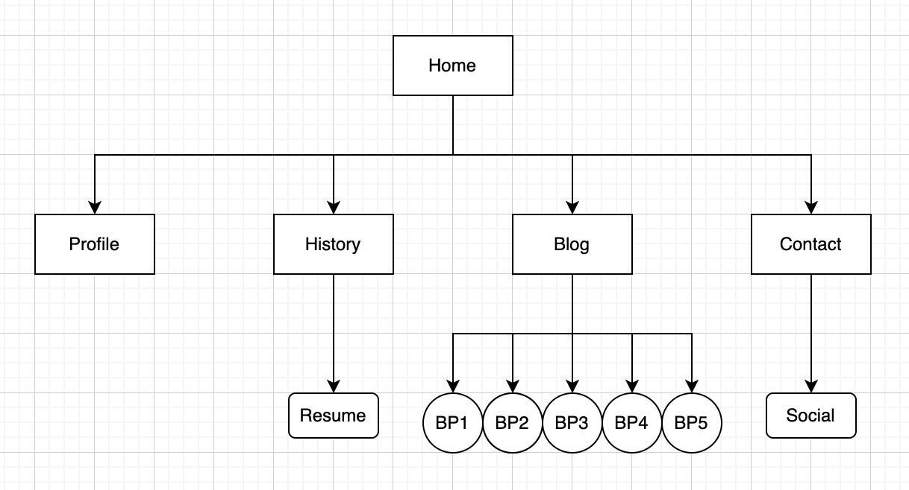

# T1A2 - Portfolio

## Purpose

The purpose of this portfolio is to showcase my capabilities.

## Functionality / Features

I have made my portfolio homepage in the form of a search engine, as a way to 'lookup' my profile. I also wanted to incorporate a computer feel with the menu bar across the top. 
The search button also links to the Profile page as a 'search' feature.
There is also use of animation on this page as if the viewer is typing my name out into the 'search engine'.

My Edit page features my blog links and uses the hover function to increase the display of each blog card. 
The View page has a contact form centred in the page, along with tags hyperlinked to my social accounts.
The history page uses a pagination to navigate between the three different tabs.
The profile page uses a color change upon hover of the header text, as if clicking on a hyperlink as would be found in a 'search results' page.

All of the pages (excluding the homepage) features a dropdown menu to navigate between the different pages.

## Sitemap

## Screenshots

## Target Audience

The target audience is potential employers from within the tech industry.

## Tech Stack

- HTML
- CSS
- Sass
- Netlify

